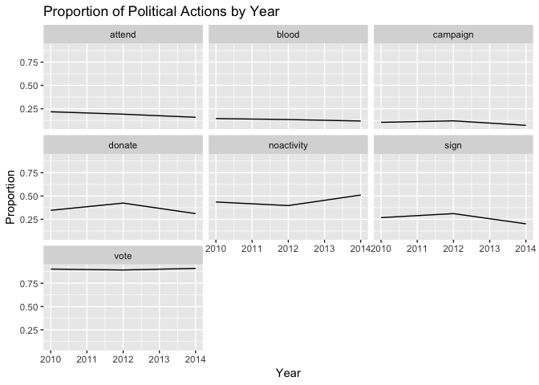

CCES Analysis
================

This document will run through an example analysis of how to read in
data from the `data` directory in an R project for proper display within
a remote GitHub repository.

## Data

The data is within the `cces-project/data/CCES_panel/` directory. The
current working directory of the R project is the
`cces-project/analysis` directory, so we will need to direct the path up
one directory using `../`. We’ll also need to unzip the file before
reading it in to the R
environment:

``` r
unzip(zipfile = "../data/CCES_panel/CCES_Panel_Full3waves_VV_V4.dta.zip",
      exdir   = "../data/CCES_panel")

# note encoding = "latin1" needed to read in the file on Mac
data <- read_dta("../data/CCES_panel/CCES_Panel_Full3waves_VV_V4.dta", encoding = "latin1")
```

## Analysis

We will plot the proportion of political actions by year. First we need
prepare the data. We will rename some of the key variables to be used in
a plot, and calculate the proportion of select political actions by year
using `dplyr` commands.

``` r
prop_pol_action <- data %>%
  rename_at(vars(contains("VV_general")), funs(str_replace(., "VV_general", "CC_417a_7"))) %>%
  select(contains("417a")) %>%
  rename(CC10_417a_7= CC_417a_7_10) %>%
  rename(CC12_417a_7= CC_417a_7_12) %>%
  rename(CC14_417a_7= CC_417a_7_14) %>%
  mutate_at(vars(contains("CC_417a_7")), funs(if_else(. %in% c(6,9), 0, 1))) %>% #recode validated turnout variables
  mutate_at(vars(contains("417a_")), funs(if_else(. == 2, 0, 1))) %>% #recode all non-voting activity variables
  rename_at(vars(contains("417a_1")), funs(str_replace(., "417a_1", "act_attend"))) %>%
  rename_at(vars(contains("417a_2")), funs(str_replace(., "417a_2", "act_sign"))) %>%
  rename_at(vars(contains("417a_3")), funs(str_replace(., "417a_3", "act_campaign"))) %>%
  rename_at(vars(contains("417a_4")), funs(str_replace(., "417a_4", "act_donate"))) %>%
  rename_at(vars(contains("417a_5")), funs(str_replace(., "417a_5", "act_blood"))) %>%
  rename_at(vars(contains("417a_6")), funs(str_replace(., "417a_6", "act_noactivity"))) %>%
  rename_at(vars(contains("417a_7")), funs(str_replace(., "417a_7", "act_vote"))) %>%
  select(contains("act")) %>%
  rename_at(vars(contains("act")), funs(str_replace(., "act_", ""))) %>%
  summarize_all(., funs(mean)) %>%
  gather("prop", key = id) %>%
  mutate(id2 = str_split(id, "_")) %>%
  mutate(year = sapply(id2, "[", 1)) %>%
  mutate(action = sapply(id2, "[", 2)) %>%
  mutate(year = as.numeric(str_sub(year, 3, 4)) + 2000) %>%
  select(year, action, prop)
```

    ## Warning: funs() is soft deprecated as of dplyr 0.8.0
    ## please use list() instead
    ## 
    ## # Before:
    ## funs(name = f(.)
    ## 
    ## # After: 
    ## list(name = ~f(.))
    ## This warning is displayed once per session.

Plot the proportion of political actions by year.

``` r
ggplot(prop_pol_action, aes(year, prop)) + 
  geom_line() +
  facet_wrap( ~ action) +
  labs(x = "Year", y = "Proportion", title = "Proportion of Political Actions by Year")
```

<!-- -->
